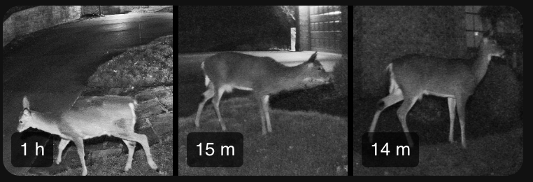

# ha-unifi-events-card

A custom Lovelace card for displaying [UniFi Protect](https://ui.com/camera-security) AI detection thumbnails on your Home Assistant dashboard — persons, vehicles, animals, and packages.

Works with the [UniFi Recent Detections AppDaemon app](https://github.com/wyne/ha-unifi-events), which fetches events from UniFi Protect and writes the event feed this card reads.



```yaml
type: custom:unifi-events-card
url: /local/unifi_events/recent.json
entity: sensor.unifi_detections_updated
count: 3
lightbox_count: 9
cols: 3
refresh_interval: 300
```

---

## Installation via HACS

1. In HACS, click the three-dot menu (top right) → **Custom repositories**
2. Paste `https://github.com/wyne/ha-unifi-events-card`, set category to **Frontend**, click **Add**
3. Find "UniFi Events Card" in HACS and click **Download**

HACS will install the card and register it as a Lovelace resource automatically.

---

## Add the dashboard card

In your dashboard, add a **Manual card**:

```yaml
type: custom:unifi-events-card
url: /local/unifi_events/recent.json
entity: sensor.unifi_detections_updated
count: 3
lightbox_count: 6
cols: 3
refresh_interval: 300
```

| Key                | Default | Description                                                                                               |
| ------------------ | ------- | --------------------------------------------------------------------------------------------------------- |
| `url`              | —       | Path to `recent.json` produced by the AppDaemon app (required)                                            |
| `entity`           | —       | HA entity ID updated by AppDaemon on new detections; triggers instant card refresh with zero idle polling |
| `count`            | `3`     | Thumbnails shown in the card grid                                                                         |
| `lightbox_count`   | `6`     | Thumbnails shown when the card is tapped; these labels also show the wall-clock time                      |
| `cols`             | `3`     | Columns per row in both the grid and lightbox                                                             |
| `refresh_interval` | `300`   | Fallback polling interval in seconds (only active if `entity` is not set or as a safety net)              |

---

## Local development

**1. Generate event data**

From the [ha-unifi-events](https://github.com/wyne/ha-unifi-events) repo:

```bash
cd apps/recent_detections
python3 recent_detections.py --count 6
```

This writes thumbnails and `output/recent.json` next to the script, in `apps/recent_detections/`.

**2. Symlink or copy the output**

```bash
# From ha-unifi-events-card repo root (the CLI writes output/ next to the script)
ln -s /path/to/ha-unifi-events/apps/recent_detections/output output
```

**3. Serve and open**

```bash
python3 -m http.server 8080
# open http://localhost:8080/test_card.html
```
